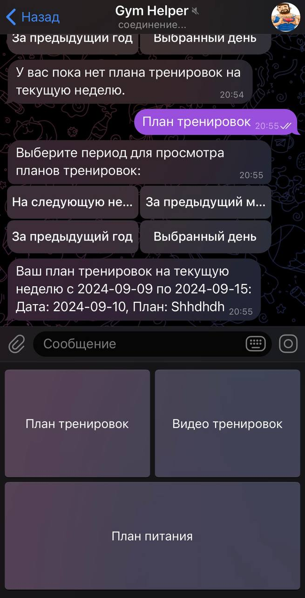
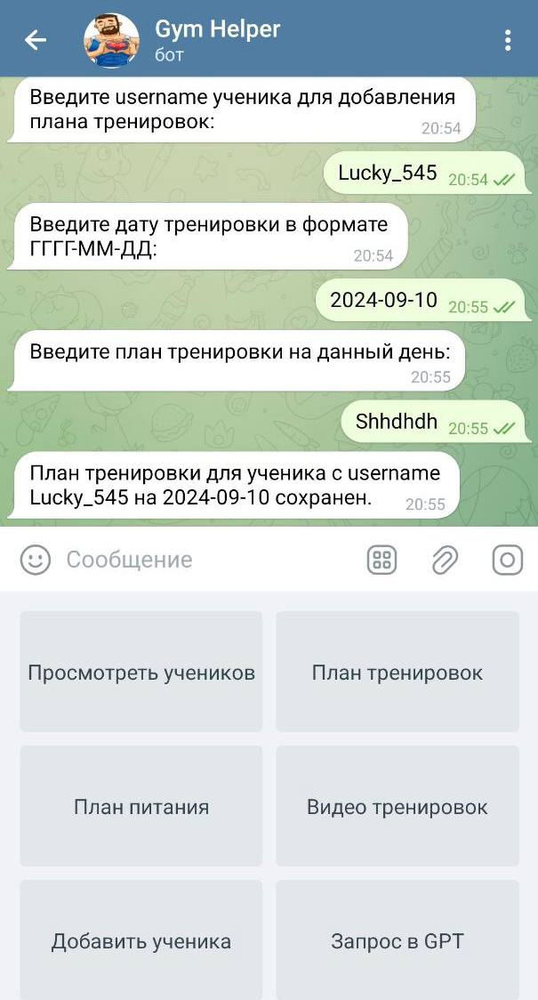

# Gym Helper Bot 🏋️‍♂️🤖

Telegram-бот для тренеров и их учеников для управления планами тренировок и питания.

## Описание 📖

Этот бот позволяет тренерам и ученикам управлять тренировочными и питательными планами, загружать видео тренировок, а также устанавливать связи между тренером и учеником. Проект написан на Python с использованием библиотеки `telebot` и базы данных PostgreSQL.

## Функциональность 🔍

- **Регистрация и выбор роли**: Пользователь может выбрать роль "Тренер" или "Ученик".
- **Управление планами**: Возможность тренеру добавлять планы тренировок и питания, а ученику просматривать.
- **Видео тренировки**: Тренеры могут смотреть видео тренировок, а ученики — загружать и просматривать их.
- **Связи тренер-ученик**: Управление связями между тренерами и учениками.

## Структура проекта 📂

Проект организован в несколько модулей:

- **`gym_bot_project/`**: Основная папка с файлами для работы бота.
- **`.env`**: Переменные окружения (например, ключи API).
- **`Dockerfile`** и **`docker-compose.yaml`**: Настройка для контейнеризации проекта.
- **`requirements.txt`**: Зависимости Python для проекта.
- **`LICENSE`**: Лицензионное соглашение для проекта.
- **`.gitignore`**: Список файлов и папок, которые будут игнорироваться системой контроля версий Git.
- **`README.md`**: Основной файл с описанием проекта, инструкциями по установке и использованию.

## Установка и запуск 🚀

1. **Клонируйте репозиторий**:

    ```bash
    git clone https://github.com/LuckyAm20/tg_bot_gym.git
    cd tg_bot_gym
    ```

2. **Создайте и настройте `.env` файл**. Используйте пример `example_env` и заполните его своими данными.

3. **Сборка и запуск Docker контейнеров**:

    ```bash
    docker-compose up --build
    ```

4. **Запустите бота**:

    Бот будет доступен через Telegram.

## Скриншоты работы бота 📸


<div style="display: flex; justify-content: space-between; flex-wrap: wrap;">
  
  
</div>


## Используемые технологии 🛠️

- Python
- Telegram API (`telebot`)
- PostgreSQL
- Docker и Docker Compose


## © Лицензия

Этот проект распространяется под лицензией MIT. Подробнее см. файл [LICENSE](LICENSE).

## 👨‍💻 Автор

- [Aptukov Mikhail - github](https://github.com/LuckyAm20)